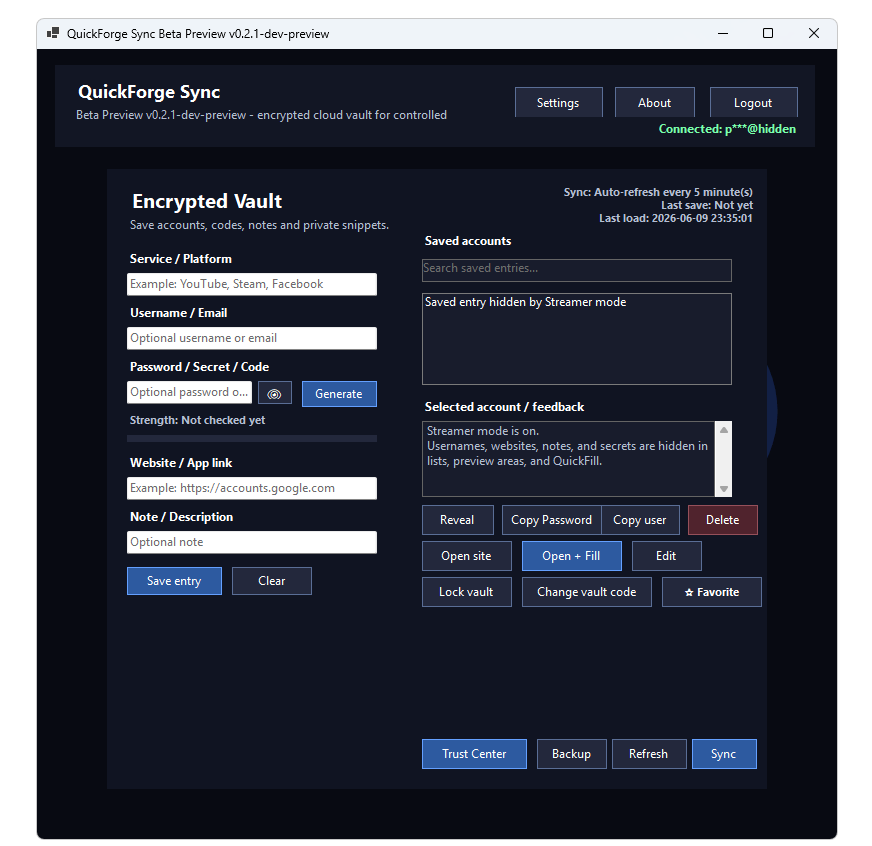
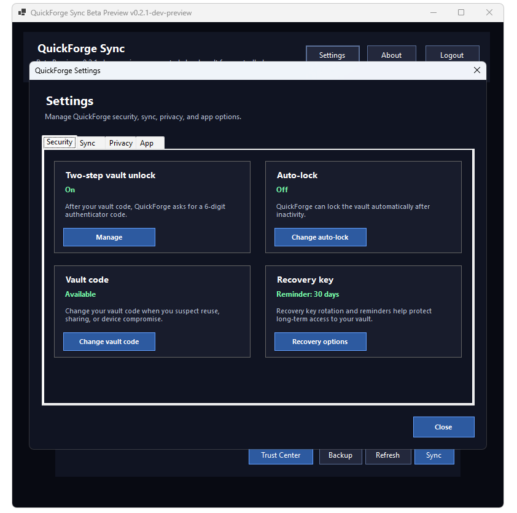
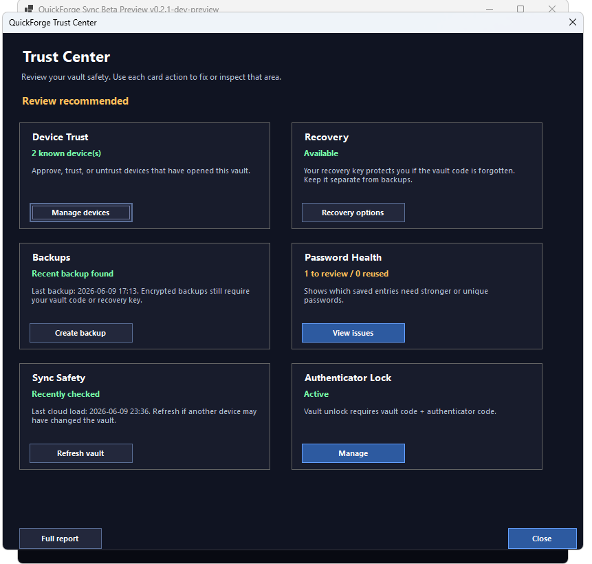
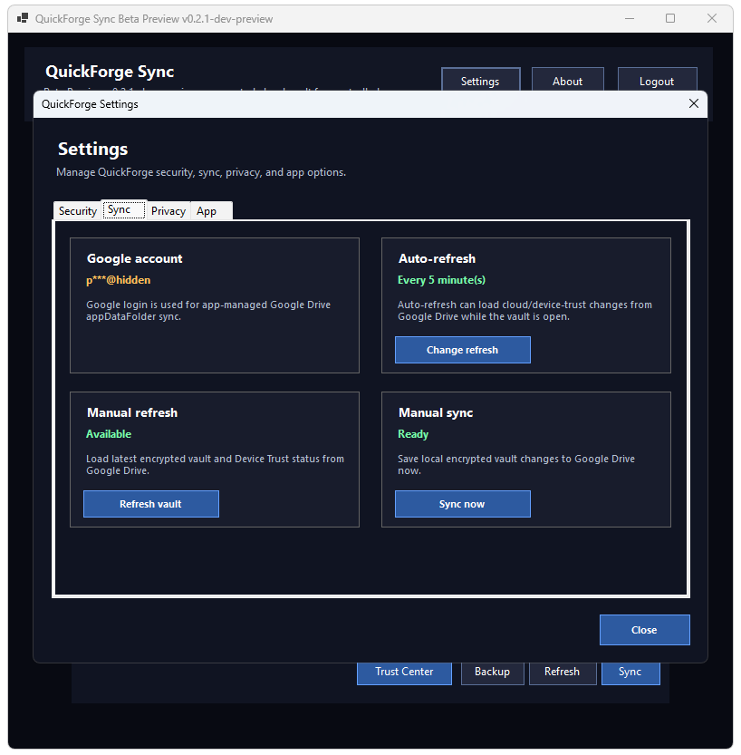
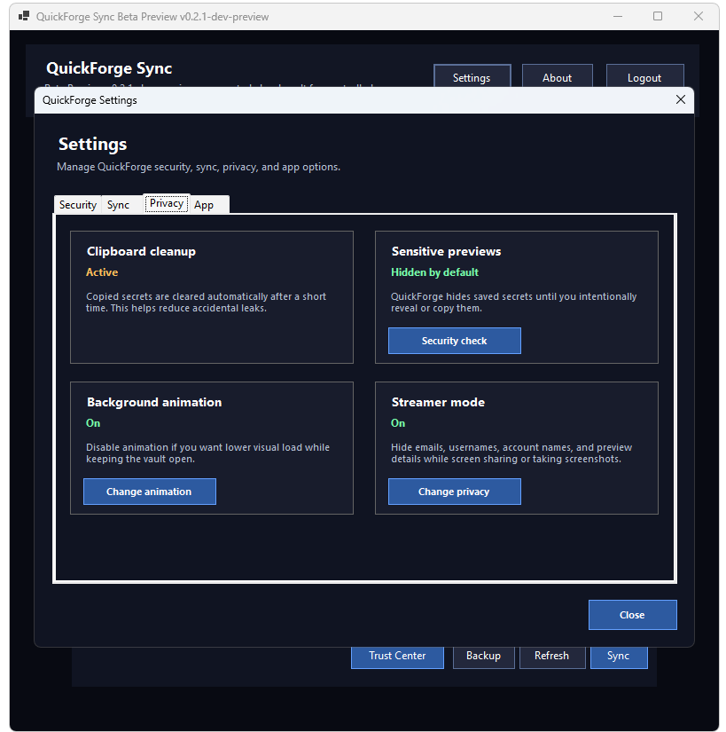
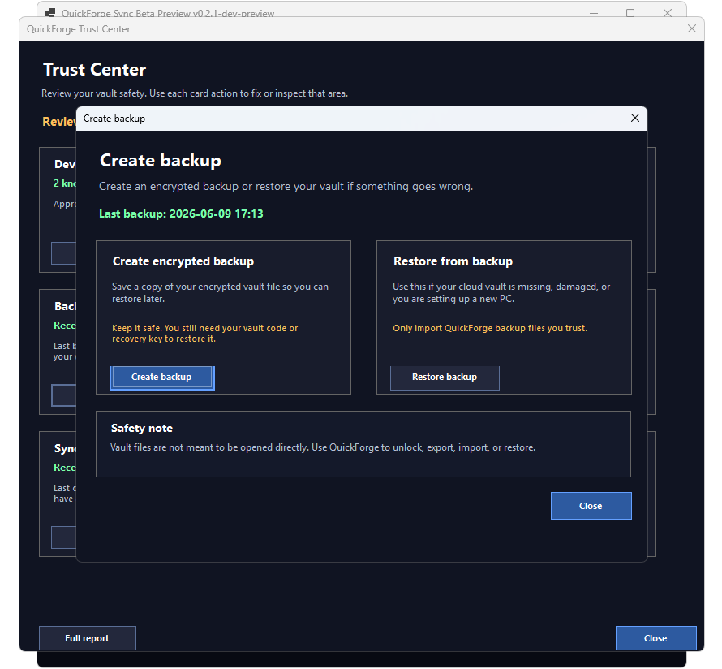

# QuickForge Sync

[](https://github.com/RexStarGame/QuickForge-Sync/actions/workflows/dotnet-tests.yml)

**QuickForge Sync** is a Windows encrypted vault for passwords, private codes, license keys, recovery notes, and personal snippets.

It focuses on being fast to use, easy to understand, and safer than storing secrets in plain text files.

> **Beta Preview notice:** QuickForge Sync is currently a beta-preview project. It has local automated crypto/backup tests and controlled personal beta testing, but it has **not** received an external security audit yet. Use fake/test data unless you are doing a controlled personal beta test.

---

## Download Beta Preview

The easiest way to test QuickForge Sync is through GitHub Releases:

> **Warning:** Older versions may have issues. Please use the latest release.

[Download QuickForge Sync Beta Preview](https://github.com/RexStarGame/QuickForge-Sync/releases)

For normal testers:

1. Download the latest `QuickForge-Sync-v0.2.2-security-stability-trust-win-x64.zip`.
2. Extract the ZIP first.
3. Open the extracted folder.
4. Run `QuickForge Sync.exe`.
5. Click **Continue with Google**.
6. Create or unlock your encrypted vault.

The beta ZIP includes the app Google OAuth desktop configuration file, `credentials.json`, so testers can sign in with their own Google account.

The beta ZIP must **not** include:

- Google user tokens
- `.qfvault` backup files
- user vault files
- private test data
- debug `.pdb` files

---

## Looking for Beta Testers

QuickForge Sync v0.2.2 Security, Stability & Trust is ready for controlled self-testing.

Please use **fake/test data only**. Do not use real passwords, banking accounts, main email accounts, crypto wallets, business admin accounts, or anything you cannot afford to lose.

Suggested test steps:

1. Download and extract the ZIP.
2. Run `QuickForge Sync.exe`.
3. Login with Google.
4. Create a vault.
5. Add 3 fake entries.
6. Lock and unlock the vault.
7. Try QuickFill if possible.
8. Export an encrypted backup.
9. Restore the backup.
10. Enable Authenticator Lock.
11. Lock and unlock with Authenticator Lock.
12. Turn Authenticator Lock off and on again.
13. Try Streamer / Privacy mode.
14. Report anything confusing, scary, slow, or broken.

Feedback format:

```text
Worked:
Failed:
Confusing:
Screenshot:
Windows version:
```

---

## What QuickForge Sync Does

QuickForge Sync helps you save and use:

- Passwords
- Game codes
- License keys
- Recovery notes
- Private snippets
- Website/app login details

Your vault is encrypted before it is saved locally or synced to Google Drive.

---

## Main Features

### Vault and Encryption

- Encrypted local/cloud vault
- Google Drive `appDataFolder` cloud storage
- Vault code unlock
- Recovery key unlock
- Recovery key rotation
- Change vault code flow
- Lockout after repeated wrong unlock attempts
- Auto-lock for safety

### Authenticator Lock

- Optional Authenticator Lock with 6-digit authenticator app codes
- Vault code is required before the authenticator code
- Works with common authenticator apps such as Google Authenticator, Microsoft Authenticator, Aegis, 2FAS, and similar apps
- QR setup confirmation before enabling Authenticator Lock
- OFF → ON → OFF → ON behavior without forcing a new QR every time
- Setup/manage flow fixes so Authenticator Lock no longer freezes
- Broken, deleted, old, or wrong QR recovery path
- Recovery key remains the emergency path if authenticator access is lost
- Fast ON/OFF UI feedback with safe background sync

### Google Drive Sync

- App-managed Google Drive `appDataFolder` storage
- Background cloud sync
- Manual sync
- Auto-refresh support
- Cloud-vault-missing recovery guidance
- Same-account multi-device sync support
- Sync conflict merge protection
- Safe-close protection while sync/refresh/background sync is running

### Trust Center and Device Trust

- Trust Center overview
- Device Trust overview
- Authenticator Lock card with Optional / Active status
- Authenticator Lock Set up / Manage actions from Trust Center
- Same-account multi-device Device Trust detection
- Untrusted-device restrictions for sensitive actions
- Backup/export and Trust Center access blocked on untrusted devices
- Device Trust “Forget selected” behavior for old, unknown, work, test, or lost devices
- Current device cannot be forgotten by accident
- Clear feedback for which saved accounts and security areas need attention

### Backup and Restore

- Manual encrypted backup export
- Manual encrypted backup restore
- Friendly backup filenames
- Backup restore warning
- Wrong-code backup rejection
- Corrupted/random backup rejection
- Backup/export blocked on untrusted devices

Example backup filename:

`QuickForge-Encrypted-Backup-07-June-2026_at_23h36.qfvault`

Backup files are still encrypted. They require your vault code or recovery key before import.

### Daily Use

- QuickFill with `Ctrl + Alt + Q`
- Search/filter saved entries
- Favorite saved entries
- Copy username
- Copy password/secret
- Open website
- Open and fill
- Clipboard cleanup after copying secrets

### Password Safety

- Password generator
- Live password strength feedback
- Weak password warnings
- Reused password warnings
- Security Center overview
- Clear feedback for which saved accounts need attention

### Streamer / Privacy Mode

- Streamer mode for safer screen sharing, screenshots, and recordings
- Hides or reduces visible sensitive details where possible
- Clear warning/feedback when Streamer mode is off and sensitive details may be visible
- Faster Streamer mode save feedback
- Safe background sync for Streamer mode changes

### User Safety Dialogs

v0.2.2 strengthens security, stability, trust, and affordance around:

- Authenticator Lock setup
- Authenticator Lock disable/re-enable
- Broken/old authenticator QR recovery
- Device Trust
- Forget selected device
- Current-device forget prevention
- Streamer mode warning/feedback
- Auto-lock settings
- Auto-refresh settings
- Background animation settings
- Recovery reminder settings
- Delete entry confirmation
- Backup restore confirmation
- Change vault code
- Recovery key creation/rotation
- Logout / close while sync is running
- Cloud vault missing

---

## Why QuickForge Sync?

Many small password tools are either too simple, too technical, or uncomfortable for daily use.

QuickForge Sync focuses on:

- Security without confusing the user
- Clear user feedback
- Fast access with QuickFill
- Encrypted cloud sync
- Manual encrypted backups
- Better recovery guidance
- Low-friction daily use
- Safer multi-device behavior

---

## Security Model

QuickForge Sync does **not** store your vault as plain text.

Your saved entries are encrypted before being stored locally or uploaded to Google Drive. Manual backup files are encrypted too.

Important:

- Do not lose your vault code.
- Save your recovery key somewhere safe.
- Do not share exported backup files.
- Do not store recovery keys in public folders.
- If you lose authenticator access, use your recovery key as the emergency path.
- If you do not recognize a trusted device, untrust it and rotate your vault code/recovery key.
- This beta has not received an external security audit.

---

## Google Drive Storage

QuickForge Sync uses Google Drive `appDataFolder`.

This means the cloud vault is app-managed and is not meant to be opened directly by the user.

Vault files are not meant to be opened manually. Use QuickForge to:

- Unlock
- Export backup
- Import backup
- Restore
- Sync
- Refresh
- QuickFill

---

## QuickFill

Press `Ctrl + Alt + Q`.

QuickFill opens a small window where you can quickly search, copy, or fill saved logins.

Favorite entries appear first.

---

## Testing

Before sharing the app, follow:

[QuickForge Sync Test Checklist](TESTING.md)

For multi-device sync and restore testing:

[QuickForge Sync Multi-Device Test Checklist](MULTI_DEVICE_TEST.md)

Before publishing a beta release:

[QuickForge Sync Release Checklist](RELEASE_CHECKLIST.md)

Security test history:

[QuickForge Sync v0.2.1 Security Test History Report](SECURITY_TEST_REPORT_v0.2.1.md)

Installer/signing planning notes:

[Installer and Signing Notes](INSTALLER_SIGNING_NOTES.md)

Before using real passwords:

[Real-Data Readiness Checklist](REAL_DATA_READINESS.md)

---

## Current Beta Status

Current development version: `v0.2.2-security-stability-trust`

Current local automated test result: `76/76 tests passing`

Passed local readiness areas:

- Account isolation
- Same-account multi-device sync
- Backup export/import
- Fresh-install restore
- Corrupted/random backup rejection
- Vault-code lockout
- Recovery-key unlock and rotation
- Change vault code
- Delete entry safety
- Authenticator Lock setup
- Authenticator Lock OFF → ON → OFF → ON
- Broken/old authenticator QR recovery
- Trust Center Authenticator Lock integration
- Device Trust visibility
- Untrusted-device restrictions
- Current-device forget prevention
- Sync conflict merge
- Background cloud sync
- Auto-refresh
- Safe-close warning while sync/refresh/background sync is running
- Faster Open + Fill and QuickFill timing
- Faster settings feedback
- Streamer / Privacy mode feedback
- Reduced animation load
- Reduced Google Drive roundtrips
- Release safety cleanup

---

## Project Status

QuickForge Sync is an active beta-preview project.

Current focus:

- v0.2.2 Security, Stability & Trust controlled self-testing
- Manual release testing
- Controlled tester feedback
- Cleaner release notes
- Future installer/code-signing planning
- v0.2.2 manual user testing before merge/release

UI styling is paused unless a real bug is found.

---

## Disclaimer

QuickForge Sync is a learning/prototype project and beta-preview password vault.

Do not rely on it as your only password manager until the code has been reviewed, tested more widely, and externally audited.

Use fake/test data unless a controlled personal beta test was explicitly planned.


## Screenshots

### Encrypted Vault
QuickForge stores account notes, secrets, and private snippets in an encrypted vault. Streamer mode can hide sensitive details while screen sharing.



### Security Settings
Manage Authenticator Lock, vault code, auto-lock, and recovery options.



### Trust Center
Review device trust, recovery, backups, password health, sync safety, and Authenticator Lock from one place.



### Sync Settings
QuickForge syncs the encrypted vault through Google Drive appDataFolder, with manual refresh and manual sync controls.



### Privacy Settings
Streamer mode, sensitive previews, clipboard cleanup, and background animation controls.



### Encrypted Backup and Restore
Create encrypted backups and restore them using your vault code or recovery key.


