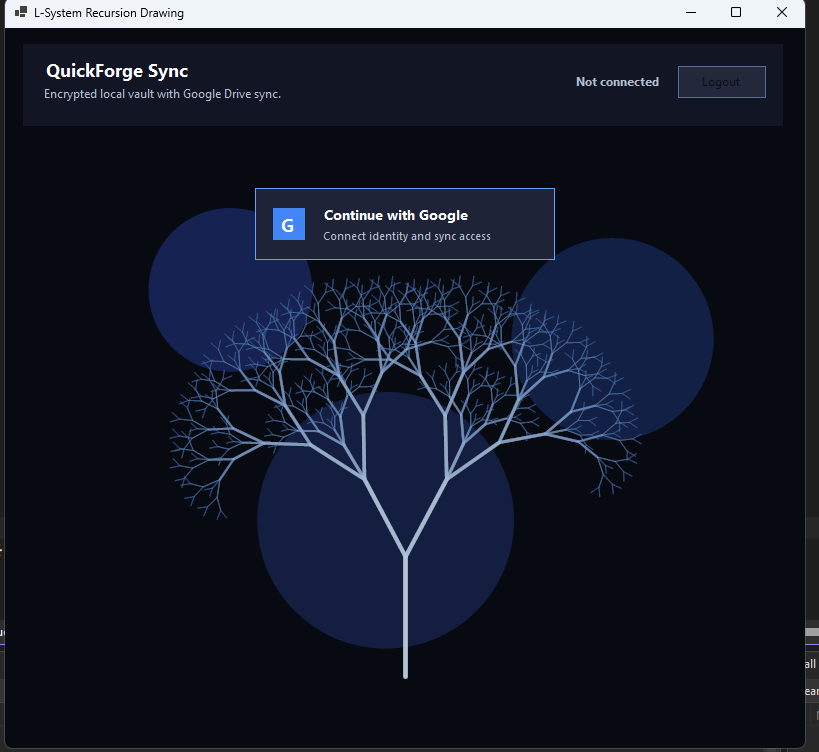

# QuickForge Sync Beta Preview

QuickForge Sync is a Windows password and private-code vault with encrypted Google Drive sync, QuickFill, password generation, recovery key support, and manual encrypted backups.

The goal is simple: keep passwords, game codes, license keys, recovery notes, and private snippets safe while still making them fast to use.

> **Beta Preview notice:** QuickForge Sync is now in beta preview. Use test data only. Do not store real passwords yet. The app has automated crypto and backup tests, but it still needs more real-world testing before stable release.

## Download Beta Preview

The easiest way to test QuickForge Sync is to download the latest beta ZIP from GitHub Releases:

[Download QuickForge Sync Beta Preview](https://github.com/RexStarGame/QuickForge-Sync/releases)

For normal testers:

1. Download the latest `.zip` file from Releases.
2. Extract the ZIP first.
3. Open the extracted folder.
4. Run `QuickForge Sync.exe`.
5. Click `Continue with Google`.
6. Use test data only. Do not store real passwords yet.

Do not clone/build the source code unless you are testing as a developer.

## Main Features

- Encrypted vault stored in Google Drive app data
- Vault code and recovery key unlock support
- QuickFill with Ctrl + Alt + Q
- Password generator with copy and fill options
- Live password strength feedback
- Show/hide toggles for sensitive input fields
- Duplicate password warning
- Clipboard cleanup after copying secrets
- Auto-lock for safety
- Security Center overview
- Vault self-check
- Favorite logins
- Search/filter saved entries
- Manual encrypted backup export/import

## Why QuickForge Sync?

Many small password tools are either too simple, too technical, or not comfortable for daily use.

QuickForge Sync focuses on:

- Security without confusing the user
- Fast access with QuickFill
- Low background usage for gamers and normal PC users
- Encrypted cloud sync
- Clear recovery and backup options

## Security Model

QuickForge Sync does not store your vault as plain text.

Your vault is encrypted before it is uploaded to Google Drive. Manual backup files are also encrypted and require your vault code or recovery key to open.

Important:

- Do not lose your vault code.
- Save your recovery key somewhere safe.
- Do not share exported backup files.
- Do not store recovery keys in public folders.

## QuickFill

Press:

Ctrl + Alt + Q

QuickFill opens a small window where you can quickly search, copy, or fill saved logins.

Favorite entries appear first.

## Encrypted Backup

QuickForge Sync supports manual encrypted backup files.

Default backup filename:

QuickForge-Backup.qfvault

These backups are still encrypted. They require your vault code or recovery key before import.

## Screenshots

### Main Vault

More screenshots will be added later.

## Testing

Before sharing the app, follow the manual test checklist:

[QuickForge Sync Test Checklist](TESTING.md)

For multi-device sync and restore testing, also follow:

[QuickForge Sync Multi-Device Test Checklist](MULTI_DEVICE_TEST.md)

Before publishing a beta release, follow:

[QuickForge Sync Release Checklist](RELEASE_CHECKLIST.md)

Installer/signing planning notes:

[Installer and Signing Notes](INSTALLER_SIGNING_NOTES.md)

Before using real passwords, follow:

[Real-Data Readiness Checklist](REAL_DATA_READINESS.md)

## Project Status

This is an active student/prototype project.

Current focus:

- Better usability
- Better security feedback
- Better backup/recovery flow
- Cleaner release build

## Disclaimer

QuickForge Sync is a learning and prototype project. Do not rely on it as your only password manager until the code has been reviewed and tested properly.

